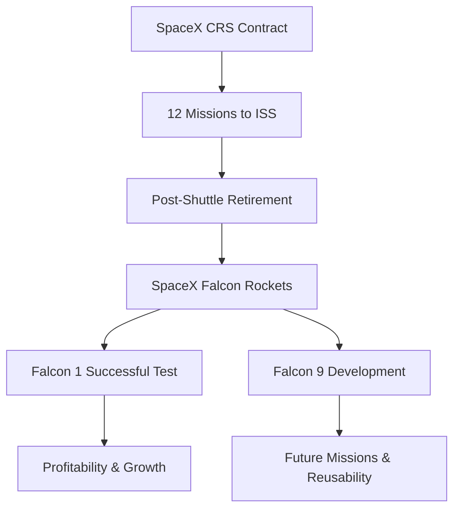

# SpaceX and NASA Collaboration - Meeting Summary

## Overview & Context
- **Purpose**: Discussion with Elon Musk about SpaceX's recent achievements, future plans, and its collaboration with NASA.
- **Participants**: Elon Musk (CEO & CTO, SpaceX), Matt Kaplan (Host, Planetary Radio), with contributions from other guests.
- **Background**: SpaceX has recently secured a $1.6 billion contract with NASA for Cargo Resupply Services (CRS) to the International Space Station (ISS).
- **Date**: Not explicitly mentioned, but the context suggests it aligns with recent SpaceX milestones.

## Key Topics & Decisions
- **NASA CRS Contract**: SpaceX awarded 12 of 20 missions for ISS resupply post-Space Shuttle retirement.
- **Company Performance**: SpaceX has been profitable for two years and holds multiple contracts beyond NASA, expected to maintain profitability for 4-5 years.
- **SpaceX Mission**: Lowering the cost and improving the reliability of space transportation to enable multi-planetary life.
- **Manufacturing Strategy**: Producing 80% of rocket components internally to reduce costs and improve reliability, paralleling historic manufacturing efficiencies like Henry Ford's.
- **Dragon Spacecraft**: Designed for potential human spaceflight with future development of an escape system, pending NASA's COTS D option.
- **Falcon 9 Development**: Set to become the most powerful single-core vehicle in the U.S., with plans for Falcon 9 Heavy.
- **SpaceX Culture**: Emphasizes open and direct communication, minimizing bureaucracy, and fostering innovation.

## Process Flow / Diagrams

## Action Items & Next Steps
- **SpaceX Tasks**:
  - Continue development and testing of Falcon 9 and Falcon 9 Heavy.
  - Develop the Dragon spacecraft escape system.
  - Maintain and expand profitability through existing contracts.
  - Focus on achieving low Earth orbit operational status.
- **NASA Collaboration**:
  - Exercise the COTS D option to enable Dragon for human spaceflight.
  - Ensure ISS resupply missions are on schedule post-Shuttle retirement.

## BCG-Style Email Summary

Subject: Summary of SpaceX and NASA Collaboration Meeting

Dear Team,

In our recent discussion with Elon Musk, CEO and CTO of SpaceX, significant strides in space transportation were highlighted, particularly SpaceX's collaboration with NASA through a $1.6 billion contract for CRS to the ISS. SpaceX's strategic focus on manufacturing 80% of its rocket components in-house aims to drastically reduce costs and improve reliability, setting the stage for future multi-planetary endeavors.

Key outcomes include:
- Securing 12 ISS resupply missions post-Space Shuttle retirement.
- Continued profitability and growth with a focus on reducing dependency on legacy aerospace supply chains.
- Development of the Falcon 9 Heavy, which will become the most powerful booster in the American lineup.

Action items moving forward involve the continued development of the Dragon spacecraft for human spaceflight and ensuring SpaceX maintains its trajectory of innovation and cost-effectiveness in space exploration. Please find detailed insights and next steps in the full meeting summary.

Best regards,

[Your Name]